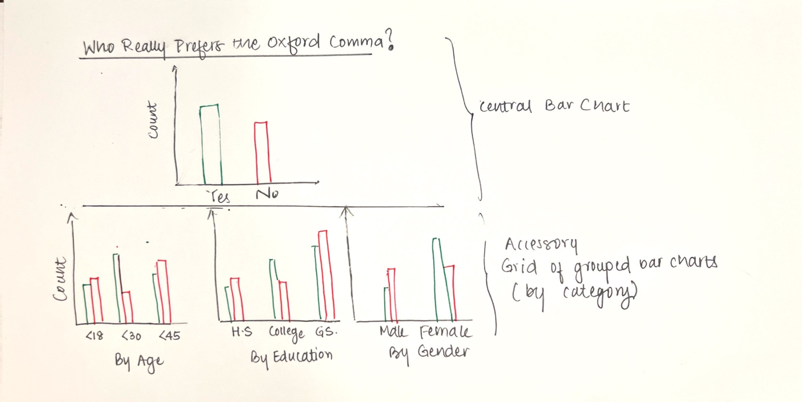

# The Oxford Comma
[Go back to main page](https://joannasam.github.io/dataviz-portfolio/)

# The Visualization 

This data visualization is from the article [“Elitist, Superfluous, Or Popular? We Polled Americans on the Oxford Comma”](https://fivethirtyeight.com/features/elitist-superfluous-or-popular-we-polled-americans-on-the-oxford-comma/) on the website [FiveThirtyEight](https://abcnews.go.com/538). It is based on the [comma-survey dataset](https://github.com/fivethirtyeight/data/blob/master/comma-survey/comma-survey.csv).

The intent of the article is to explore the demographics of Oxford comma users vs. non-users.

# Critique

## What works
The visualization is straightforward and fairly truthful. It makes sense that it intends to have a clear binary structure - both in terms of structure of the visual as well as the choice of colors.

## What does not work
The visualization misses the point of the article. It does not uncover any meaningful insight in the data, but instead is merely used to support a single argument (i.e. Oxford comma users think they have better grammar, and tend to be zealous). Essentially, the information presented is not compelling nor significant. It does not fully support the premise of the article. One glance at the data is enough to realize the missed opportunity to tell a full, well-rounded story - both by picking better attributes, as well as by drawing better comparisons. The bar chart is poorly executed and not intuitive - creating too much eye travel in order to draw a binary comparison. It would have made more sense to have a single chart with vertical columns side-by-side. Additionally, the headline lacks insight. Aesthetically, the visualization is underwhelming and uninteresting. Overall, it is incomplete - there is a lot more information in the underlying dataset.

## Primary audience

This article is quite niche and posted on a data visualization blog. The intended audience is likely someone who is either very curious and/or opinionated about the Oxford comma. They are also likely data-oriented and seeking data points to support their opinion. A reader would like to understand "where they stand" on the data spectrum of Oxford comma demographics. "Where do I fit into this picture?" "Who really is the average Oxford comma user/non-user?" This visual does little to answer those questions. It does not present any compelling insights, nor does it satisfy the reader's curiosity.
At the end of the day, the reader has an opinion and would like to see a binary comparison to know where they stand.

# Sketching a Solution

For the solution sketch, I created a central visualization with a simple bar chart comparing both preference groups bottom-line-up-front. I pulled variables of interest from the data and created an accessory grid of bar charts to analyze the demographics. These are grouped bar charts to minimize eye travel. I maintained a uniform color code (green for yes, and red for no) in order to maintain a binary perspective. 

# Testing the Solution

## Feedback 1 - MISM Student (24), Heinz College, Carnegie Mellon University
#### What do you see?
This is a chart showing what population prefers to use the Oxford comma, with different breakouts.
#### Who might find this visualization useful?
Someone who is in an argument for/against the Oxford comma.
#### What do you like?
I like the breakouts - it might be interesting to see what the data actually says about the demographics here. Who are these people, really?
#### What would you change?
The breakouts are too cluttered - maybe put them on separate pages. There's no space for a legend or X-axis labels.
#### Do you prefer to use an Oxford comma?
Never!

## Feedback 2 - MISM-BIDA Student (25), Heinz College, Carnegie Mellon University
#### What do you see?
A chart describing who is into using an Oxford comma.
#### Who might find this visualization useful?
This visual is useful for someone trying to defend their use of an Oxford comma - it's handy.
#### What do you like?
I like the different charts and how you can compare them to each other - but too much information at once.
#### What would you change?
I would separate the bars for each group so that you can see which age, education and income stands out in each preference group.
Maybe also add a subheading telling us who actually is the typical Oxford comma user - describe their profile.
#### Do you prefer to use an Oxford comma?
Yes, I do.

## Feedback Analysis
The intent of the chart is clear, and the level of information presented is appealing.
The grid of bar charts appears cluttered - leaving no space for legends, tick labels and descriptions.
The grouped chart makes it hard to analyze the preference groups individually.

# Final Solution - Tableau

For the final solution, I split out the bar charts on separate screens to ensure adequate space for headers, labels and legends - telling a story through the visuals.This also allows for the use of more color than just red and green in order to describe each category. I ungrouped the bar charts so that you can see patterns in each preference group clearly. On analyzing the visuals, I was able to derive insights from the data and used them to create a descriptive heading and subheading.

Overall, the solution is now complete, informative, engaging and insightful.

<noscript></noscript><object class='tableauViz'  style='display:none;'><param name='host_url' value='https%3A%2F%2Fpublic.tableau.com%2F' /> <param name='embed_code_version' value='3' /> <param name='site_root' value='' /><param name='name' value='Assignment34_16952647074930&#47;Story1' /><param name='tabs' value='no' /><param name='toolbar' value='yes' /><param name='static_image' value='https:&#47;&#47;public.tableau.com&#47;static&#47;images&#47;As&#47;Assignment34_16952647074930&#47;Story1&#47;1.png' /> <param name='animate_transition' value='yes' /><param name='display_static_image' value='yes' /><param name='display_spinner' value='yes' /><param name='display_overlay' value='yes' />
    <param name='display_count' value='yes' /><param name='language' value='en-US' /><param name='filter' value='publish=yes' /></object>
                

